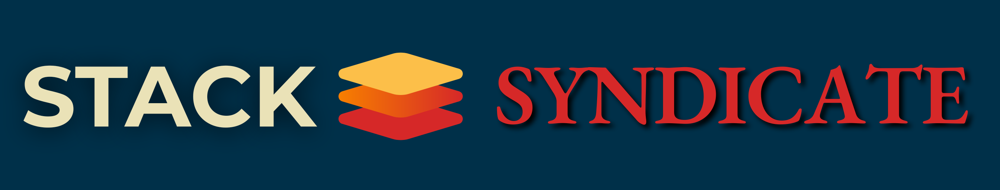

## What is this?

Stack Syndicate is a collection of scientific, creative, and technical experiments — spanning generative art, physics simulation, and developer tooling. It’s a long-term project that hopes to provide value to the Rust ecosystem, and the wider programming community.

## Philosophy

At its root, Stack Syndicate is an expression of the enthusiasm its creators have for free and open source software, indie games, creative coding in general and science.
